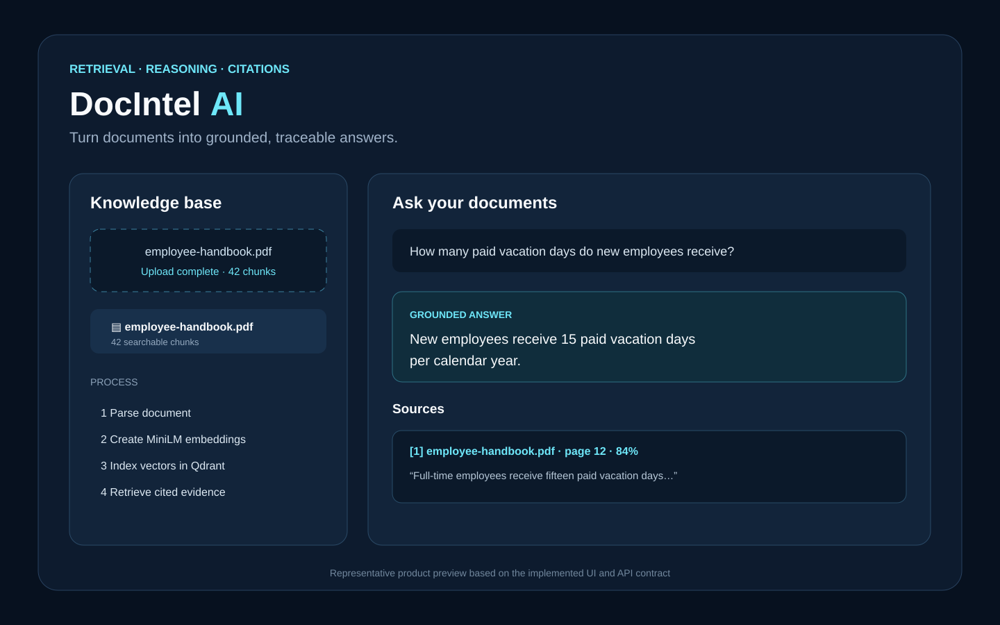
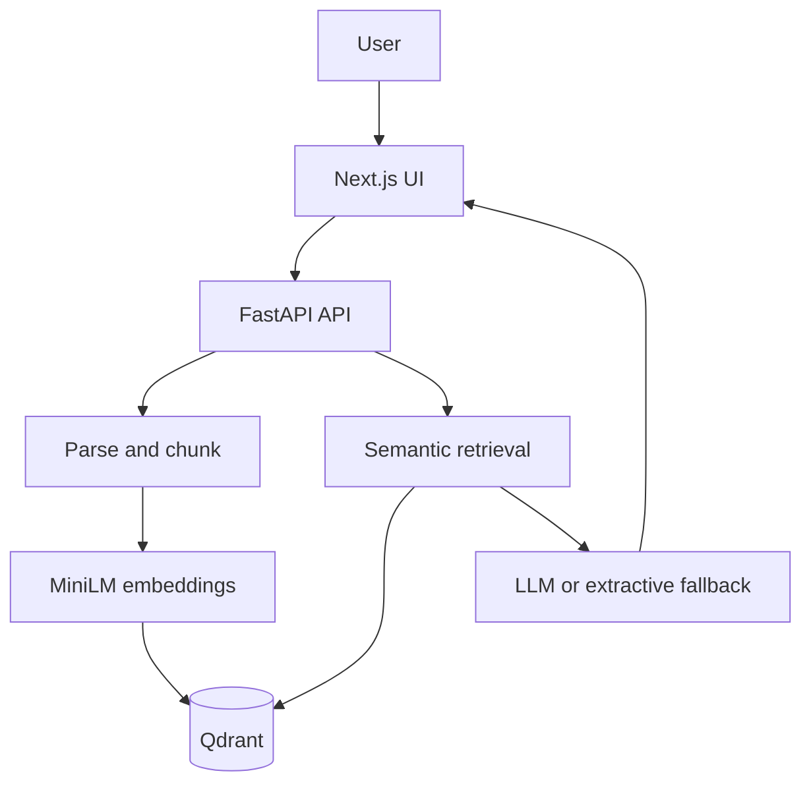

# DocIntel AI



> Representative preview generated from the implemented frontend layout and verified API response fields.

A full-stack document-intelligence application that lets users upload business documents and ask grounded questions with traceable source citations.

## Project Case Study

### Problem

Business knowledge is often fragmented across PDFs, Word documents, Markdown, and text files. Manual lookup is slow, and generic assistants can return answers without evidence that users can verify.

### What I Built

I built a full-stack document-intelligence application that ingests four document formats, chunks and embeds their contents, indexes source metadata in Qdrant, retrieves relevant passages, and returns grounded answers with document and page citations. It supports three optional LLM providers and an API-key-free extractive fallback.

### Tech Used

Python and FastAPI for ingestion and retrieval APIs; Sentence Transformers and Qdrant for semantic search; Next.js and TypeScript for the user interface; Docker Compose for reproducible local infrastructure; pytest, Ruff, and GitHub Actions for automated quality gates.

### Outcome

The application automates the complete **upload → parse → chunk → embed → retrieve → answer → cite** workflow. On the versioned four-question synthetic regression set, it records **0.417 macro Precision@K**, **1.000 macro Recall@K**, and **0.833 citation correctness**. These are reproducible offline measurements, not production-performance claims.

## Product Walkthrough


### Example user experience

**Uploaded document**

```text
employee-handbook.pdf → 42 searchable chunks
```

**Question**

> How many paid vacation days do new employees receive?

**Representative grounded response**

> New employees receive 15 paid vacation days per calendar year.  
>
> **Source:** employee-handbook.pdf · page 12  
> **Evidence:** “Full-time employees receive fifteen paid vacation days…”

The answer, provider, source filename, page number, supporting passage, and retrieval score are returned together. This example illustrates the implemented response contract; it is not an evaluation result.

### API example

```bash
curl -X POST http://localhost:8000/api/query \
  -H "Content-Type: application/json" \
  -d '{"question":"How many paid vacation days do new employees receive?","top_k":5}'
```

```json
{
  "answer": "New employees receive 15 paid vacation days per calendar year.",
  "provider": "extractive",
  "sources": [
    {
      "document_id": "example-document-id",
      "filename": "employee-handbook.pdf",
      "page": 12,
      "chunk": "Full-time employees receive fifteen paid vacation days...",
      "score": 0.84
    }
  ]
}
```

## The Problem

Important information is often scattered across PDFs, Word files, Markdown, and text documents. Manual search is slow, while general-purpose chatbots can produce answers that are difficult to verify.

## The Solution

DocIntel AI ingests documents, splits them into searchable passages, creates semantic embeddings, and stores them in Qdrant. A FastAPI retrieval service finds the most relevant evidence and sends it to a configured LLM—or returns the strongest extractive passage—while preserving document and page citations in the response.

## Tech Stack

**Python | FastAPI | Next.js | TypeScript | Sentence Transformers | Qdrant | Groq/Gemini/Mistral | Docker | GitHub Actions**

## Architecture



## Key Features

- Upload PDF, DOCX, Markdown, and TXT documents
- Chunk and embed content with `all-MiniLM-L6-v2`
- Store vectors and source metadata in Qdrant
- Retrieve evidence with document and page citations
- Generate answers with Groq, Gemini, or Mistral
- Operate without an API key through an extractive fallback
- List and delete indexed documents
- Run frontend, backend, and Qdrant with Docker Compose
- Validate backend behavior with tests and GitHub Actions CI

## Results and Measurable Evidence

| Measure | Result | Scope |
|---|---:|---|
| Evaluation questions | 4 | Versioned synthetic golden set |
| Macro retrieval Precision@K | 0.417 | Offline regression fixture |
| Macro retrieval Recall@K | 1.000 | Offline regression fixture |
| Citation correctness | 0.833 | Supported citations / returned citations |
| Supported document formats | 4 | PDF, DOCX, Markdown, TXT |
| Automated evaluation gates | 3 | Precision, recall, citation correctness |

The application automates the complete **upload → parse → chunk → embed → retrieve → answer → cite** workflow behind one API and interface. The evaluation command is reproducible with `python evaluation/evaluate.py` and is executed by GitHub Actions.

These measurements validate the engineering and regression pipeline. They do not represent production traffic, user-volume, latency, cost savings, or independently audited model quality.

## Screenshots / Demo

The application is currently available as a reproducible local demo:

- Web application: `http://localhost:3000`
- Interactive API documentation: `http://localhost:8000/docs`
- Qdrant dashboard: `http://localhost:6333/dashboard`

After starting the stack, upload a document in the web interface and ask a question about its contents. The answer view returns the supporting source passages and citations.

## How to Run

### Prerequisites

- Docker and Docker Compose
- Optional: a Groq, Gemini, or Mistral API key

### Setup

```bash
git clone https://github.com/ParamasivaVemavarapu/DocIntel_AI.git
cd DocIntel_AI
cp backend/.env.example backend/.env
docker compose up --build
```

The default extractive mode requires no LLM key. To enable generated answers, set `LLM_PROVIDER` and the matching provider key in `backend/.env`.

## API

| Method | Endpoint | Purpose |
|---|---|---|
| `GET` | `/health` | Check service and vector-store health |
| `POST` | `/api/documents` | Upload and index a document |
| `GET` | `/api/documents` | List indexed documents |
| `DELETE` | `/api/documents/{document_id}` | Delete a document and its vectors |
| `POST` | `/api/query` | Retrieve evidence and answer a question |

## Environment Variables

| Variable | Default | Purpose |
|---|---|---|
| `QDRANT_URL` | `http://qdrant:6333` | Vector-store endpoint |
| `COLLECTION_NAME` | `docintel_chunks` | Qdrant collection |
| `LLM_PROVIDER` | `extractive` | Answer provider |
| `GROQ_API_KEY` | empty | Groq credentials |
| `GOOGLE_API_KEY` | empty | Gemini credentials |
| `MISTRAL_API_KEY` | empty | Mistral credentials |

## Engineering Quality

This repository includes modular Python services, typed API contracts, environment-based configuration, automated tests with coverage, Ruff linting, TypeScript checks, reproducible Docker builds, and GitHub Actions CI. See [Engineering Quality](docs/ENGINEERING.md) for the quality gates and production-readiness boundary.

## Production Roadmap

- Add screenshots and a hosted demonstration
- Add hybrid search, reranking, and retrieval evaluation
- Add OCR for scanned documents
- Add authentication, tenant isolation, rate limiting, and file scanning
- Add conversational memory and multi-hop retrieval

## Reproducible Evaluation

The versioned [evaluation suite](evaluation/README.md) reports macro retrieval Precision@K, Recall@K, and citation correctness from a human-labeled synthetic regression set.

```bash
python evaluation/evaluate.py
```

The dataset and recorded outputs are intentionally small and synthetic. They validate the metric pipeline and provide regression gates; they are not presented as production-performance evidence.

## License

MIT — see [LICENSE](LICENSE).
