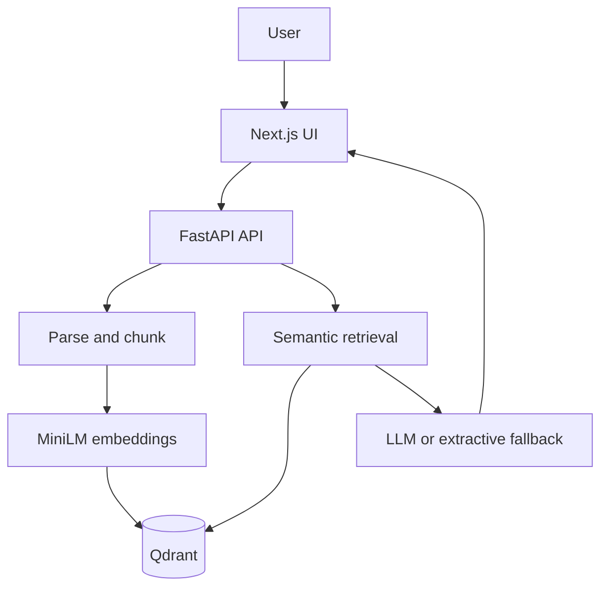

# DocIntel AI

A full-stack document-intelligence application that lets users upload business documents and ask grounded questions with traceable source citations.

## The Problem

Important information is often scattered across PDFs, Word files, Markdown, and text documents. Manual search is slow, while general-purpose chatbots can produce answers that are difficult to verify.

## The Solution

DocIntel AI ingests documents, splits them into searchable passages, creates semantic embeddings, and stores them in Qdrant. A FastAPI retrieval service finds the most relevant evidence and sends it to a configured LLM—or returns the strongest extractive passage—while preserving document and page citations in the response.

## Tech Stack

**Python | FastAPI | Next.js | TypeScript | Sentence Transformers | Qdrant | Groq/Gemini/Mistral | Docker | GitHub Actions**

## Architecture



## Key Features

- Upload PDF, DOCX, Markdown, and TXT documents
- Chunk and embed content with `all-MiniLM-L6-v2`
- Store vectors and source metadata in Qdrant
- Retrieve evidence with document and page citations
- Generate answers with Groq, Gemini, or Mistral
- Operate without an API key through an extractive fallback
- List and delete indexed documents
- Run frontend, backend, and Qdrant with Docker Compose
- Validate backend behavior with tests and GitHub Actions CI

## Results

The implemented system demonstrates an end-to-end RAG workflow: multi-format ingestion, semantic indexing, evidence retrieval, grounded answer generation, and citation return through one user interface. No formal retrieval-quality or latency benchmark is claimed yet; a golden question set and RAG evaluation are documented as the next measurement step.

## Screenshots / Demo

The application is currently available as a reproducible local demo:

- Web application: `http://localhost:3000`
- Interactive API documentation: `http://localhost:8000/docs`
- Qdrant dashboard: `http://localhost:6333/dashboard`

After starting the stack, upload a document in the web interface and ask a question about its contents. The answer view returns the supporting source passages and citations.

## How to Run

### Prerequisites

- Docker and Docker Compose
- Optional: a Groq, Gemini, or Mistral API key

### Setup

```bash
git clone https://github.com/ParamasivaVemavarapu/DocIntel_AI.git
cd DocIntel_AI
cp backend/.env.example backend/.env
docker compose up --build
```

The default extractive mode requires no LLM key. To enable generated answers, set `LLM_PROVIDER` and the matching provider key in `backend/.env`.

## API

| Method | Endpoint | Purpose |
|---|---|---|
| `GET` | `/health` | Check service and vector-store health |
| `POST` | `/api/documents` | Upload and index a document |
| `GET` | `/api/documents` | List indexed documents |
| `DELETE` | `/api/documents/{document_id}` | Delete a document and its vectors |
| `POST` | `/api/query` | Retrieve evidence and answer a question |

## Environment Variables

| Variable | Default | Purpose |
|---|---|---|
| `QDRANT_URL` | `http://qdrant:6333` | Vector-store endpoint |
| `COLLECTION_NAME` | `docintel_chunks` | Qdrant collection |
| `LLM_PROVIDER` | `extractive` | Answer provider |
| `GROQ_API_KEY` | empty | Groq credentials |
| `GOOGLE_API_KEY` | empty | Gemini credentials |
| `MISTRAL_API_KEY` | empty | Mistral credentials |

## Production Roadmap

- Add screenshots and a hosted demonstration
- Add hybrid search, reranking, and retrieval evaluation
- Add OCR for scanned documents
- Add authentication, tenant isolation, rate limiting, and file scanning
- Add conversational memory and multi-hop retrieval

## License

MIT — see [LICENSE](LICENSE).
